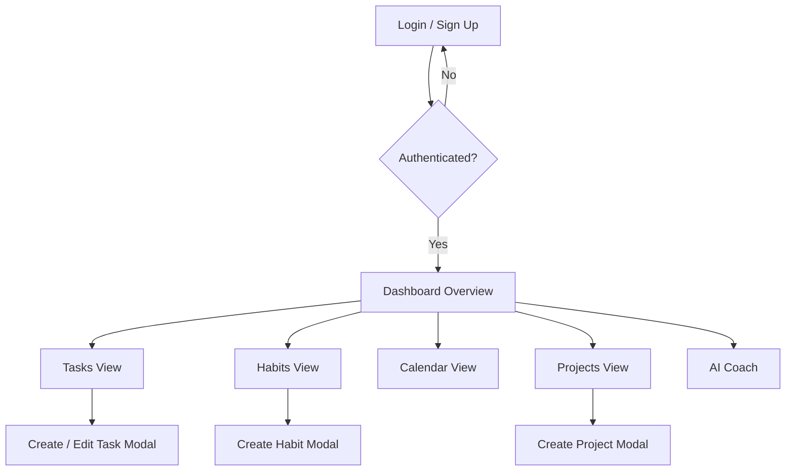

# App Flow

This document maps out the user journey through TetherOS.

## Core Navigation Flow
The primary navigation occurs via the collapsible Sidebar, connecting the Dashboard overview to deep-dive modules.

## Screen-by-Screen Breakdown

### 1. Dashboard (`/dashboard`)
- **Purpose**: The nerve center. 
- **Actions**:
  - View aggregate charts.
  - See immediate upcoming events.
  - View top tasks.
  - Click any widget to navigate to the detailed view.

### 2. Tasks (`/dashboard/tasks`)
- **Purpose**: Manage the queue.
- **Actions**:
  - View 3 columns: To Do, In Progress, Done.
  - Click "New Task" -> Opens a Modal to input Title, Tags, Priority.
  - Click on a Task -> View details or drag to another column.

### 3. Habits (`/dashboard/habits`)
- **Purpose**: Build routines.
- **Actions**:
  - Click checkmarks to mark habit as complete for the day.
  - View past 7-day consistency graphs.

### 4. Journal (`/dashboard/journal`)
- **Purpose**: Reflection.
- **Actions**:
  - Start a new daily reflection entry.
  - Save entry to history.

### 5. Focus Timer (`/dashboard/focus`)
- **Purpose**: Deep work.
- **Actions**:
  - Adjust countdown minutes.
  - Start / Pause / Reset timer.
  - Ring visualization fills/depletes as time passes.

### 6. AI Coach (`/dashboard/coach`)
- **Purpose**: Guidance.
- **Actions**:
  - Type a query ("Why am I procrastinating on X?").
  - System returns a simulated response based on the mock context data.
