# Backend Schema

When TetherOS transitions from client-side mock data to a robust backend, the following data model is proposed. It is designed to be easily implemented in a relational database like PostgreSQL (using Prisma or Drizzle ORM) or stored locally in SQLite for a local-first architecture.

## Entity-Relationship Diagram

```mermaid
erDiagram
    USER ||--o{ TASK : creates
    USER ||--o{ HABIT : tracks
    USER ||--o{ PROJECT : owns
    USER ||--o{ EVENT : schedules
    USER ||--o{ JOURNAL_ENTRY : writes
    
    PROJECT ||--o{ TASK : "has many"

    USER {
        uuid id PK
        string email
        string name
        string password_hash
        timestamp created_at
    }

    TASK {
        uuid id PK
        uuid user_id FK
        uuid project_id FK "nullable"
        string title
        string status "To Do, In Progress, Done"
        string priority "High, Medium, Low"
        string tag
        timestamp created_at
        timestamp due_date "nullable"
    }

    HABIT {
        uuid id PK
        uuid user_id FK
        string name
        int current_streak
        int longest_streak
        jsonb completion_history
    }

    PROJECT {
        uuid id PK
        uuid user_id FK
        string title
        string description
        string status "Active, Behind, Completed"
        string color_hex
    }

    EVENT {
        uuid id PK
        uuid user_id FK
        string title
        timestamp start_time
        timestamp end_time
        boolean is_all_day
    }

    JOURNAL_ENTRY {
        uuid id PK
        uuid user_id FK
        text content
        string mood
        timestamp created_at
    }
```

## Considerations for Local-First Sync
- **UUIDs**: All primary keys are UUIDs (`v4`) to allow client-side generation without waiting for the server.
- **CRDTs / Versioning**: In a local-first environment (like WatermelonDB or ElectricSQL), tables will also require `updated_at` and `deleted_at` fields to handle merge conflicts and soft deletes for syncing to the cloud.
