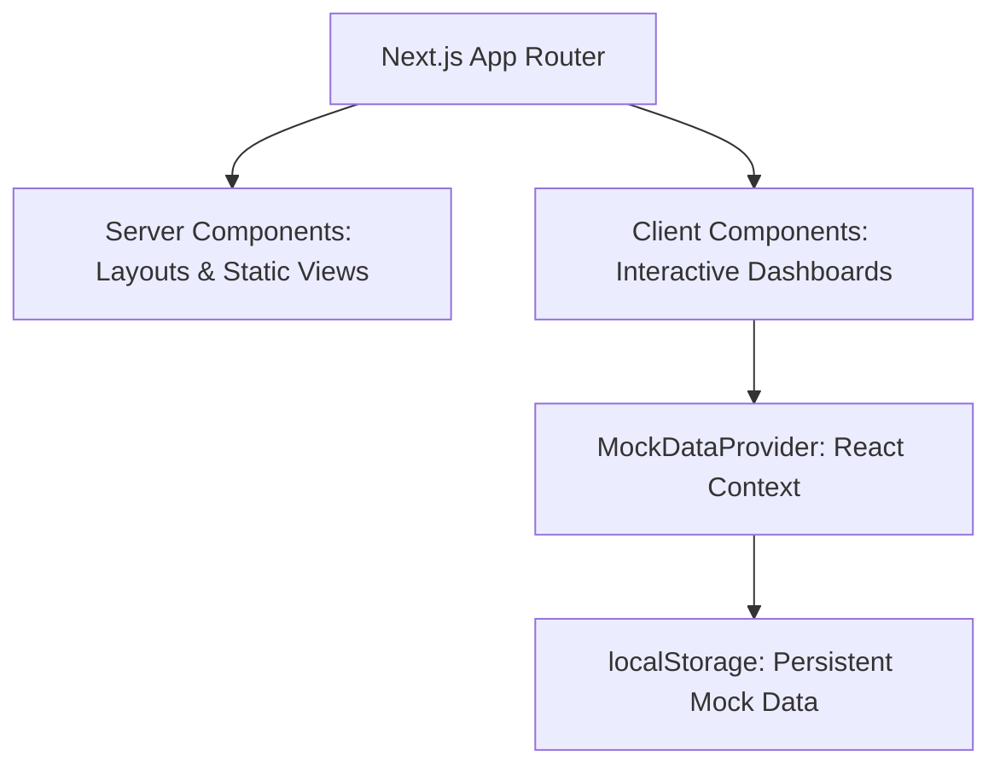
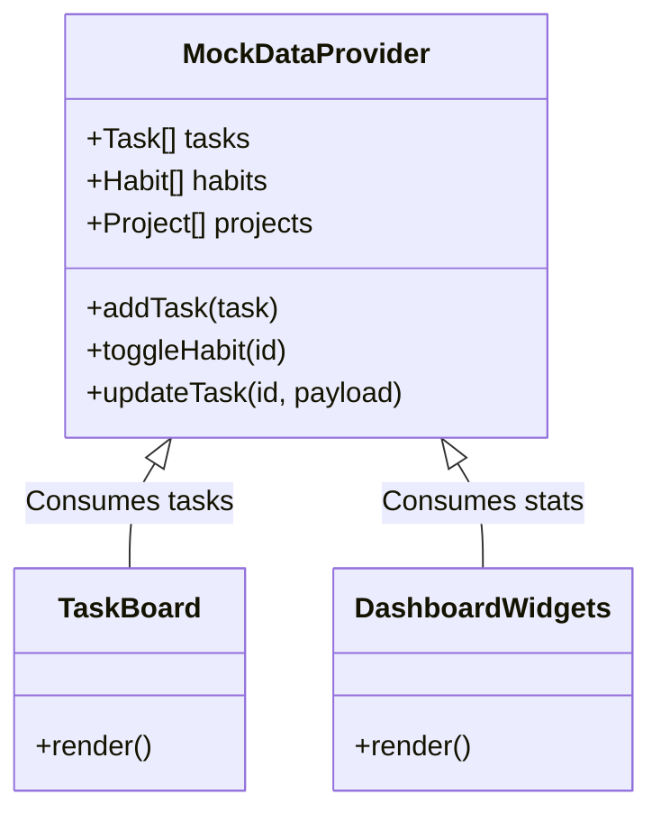

# Technical Design Document (TDD)

## 1. System Architecture
TetherOS is built as a Next.js (App Router) application. It leverages React Server Components for fast initial loads and Client Components for highly interactive, stateful UI elements (e.g., Kanban boards, forms, timers).



## 2. Frontend Architecture
- **Routing**: `app/` directory handles all route segments (`/dashboard`, `/dashboard/tasks`, etc.).
- **Components**: Separated into layout components (`TopBar`, `Sidebar`), domain-specific components (`TaskCard`, `HabitTracker`), and generic UI elements.
- **Styling**: Tailwind CSS is used extensively. Strict monochrome rules are enforced via a custom `tailwind.config.ts` (if applicable) or through utility class discipline. 

## 3. State Management (Mock Phase)
Because TetherOS currently lacks a backend, state is managed entirely on the client side using a global React Context (`MockDataProvider`).



- **Persistence**: Context state is synchronized with browser `localStorage` to survive page reloads. The initialization hook checks `localStorage` first; if empty, it hydrates with default hardcoded mock data.

## 4. Key Data Structures (Types)
```typescript
type Priority = "High" | "Medium" | "Low";
type TaskStatus = "To Do" | "In Progress" | "Done";

interface Task {
  id: string;
  title: string;
  tag: string;
  priority: Priority;
  status: TaskStatus;
  createdAt: string;
}

interface Habit {
  id: string;
  name: string;
  streak: number;
  completedToday: boolean;
  history: boolean[]; // last 7 days
}

interface Project {
  id: string;
  name: string;
  status: "Active" | "Behind" | "Completed";
  progressPct: number;
  dueDate: string;
  color: string;
}
```

## 5. Security & Privacy
In the final local-first implementation, IndexedDB will be used alongside zero-knowledge encryption (e.g., using WebCrypto API). For the current MVP mock phase, data is stored natively in plain text inside `localStorage`.
